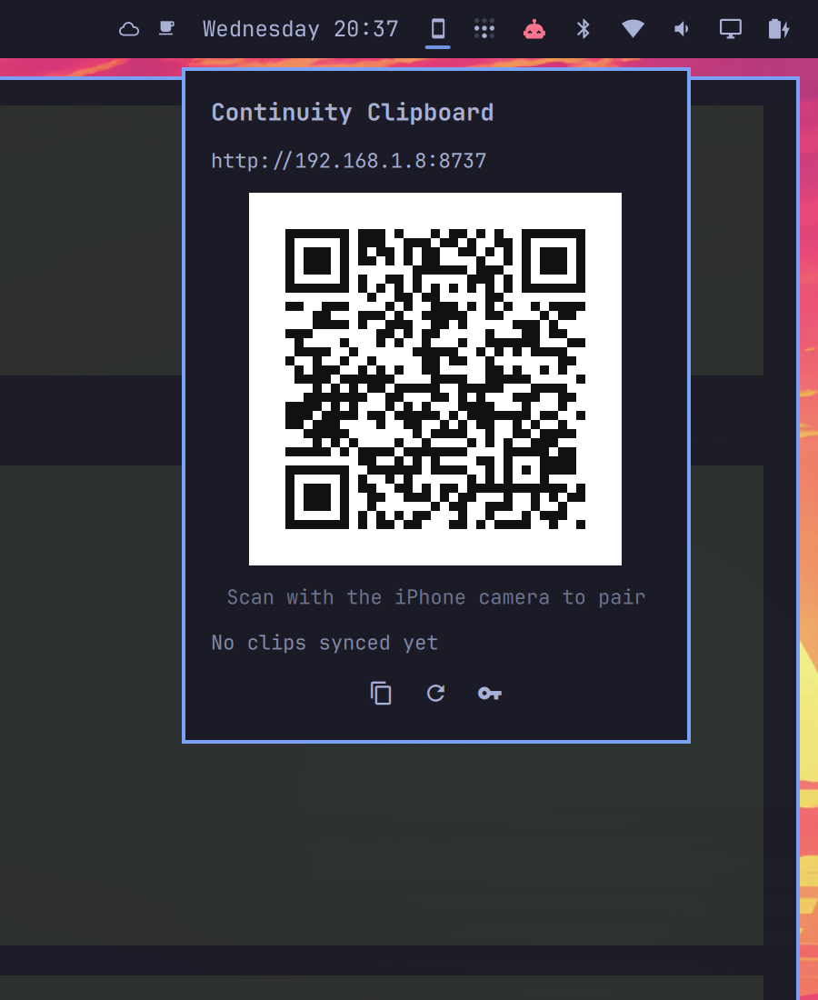

# Continuity Clipboard

Copy on your iPhone, paste on your Omarchy desktop — and back. The closest
thing to macOS Universal Clipboard that a MacBook running Omarchy can have.



The plugin runs a small token-authenticated clipboard bridge on your LAN and
pairs your iPhone with a QR scan. Two stock iOS Shortcuts then beam the
clipboard in either direction with one tap.

## How Apple does it, and how close this gets

Universal Clipboard is pull-at-paste: when you paste on a Mac, Apple's
`sharingd` daemon on the iPhone serves the clipboard *in the background*
over AWDL (Apple's proprietary peer-to-peer Wi-Fi), discovered via BLE and
encrypted with iCloud identity keys. Two of those pieces are closed to
everyone else:

- **Background clipboard reads are an Apple-private entitlement.** Since
  iOS 16, third-party software can only touch the clipboard from a
  foreground action or a user-approved Shortcut. No app, no daemon, no
  trick gets a silent background read.
- **AWDL has no Linux driver on Apple-Silicon hardware** (Asahi's
  `brcmfmac` doesn't implement it), and open reimplementations
  (OWL/opendrop) only manage "Everyone"-mode file drops on specific
  monitor-mode Wi-Fi chips — none of them speak Universal Clipboard, whose
  payloads are end-to-end encrypted with iCloud keys anyway.

So the honest ceiling for any non-Apple receiver is **one silent gesture on
the phone** — and iOS Shortcuts automations make that gesture invisible:
no site, no app, no screen. That is what this plugin ships.

## Make it feel automatic (after pairing)

- **Back Tap** (Settings → Accessibility → Touch → Back Tap → Double Tap →
  *Send to Omarchy*): copy anywhere → double-tap the back of the phone →
  paste on the desktop.
- **Action button** (iPhone 15 Pro+): Settings → Action Button → Shortcut →
  *Send to Omarchy*. Copy → click → paste on the desktop.
- **NFC tap-to-beam:** stick an NFC sticker on the MacBook palm rest;
  Shortcuts → Automation → NFC → run *Send to Omarchy* → Run Immediately.
  Copy → tap the phone on the laptop → paste on the desktop.
- **Zero-tap desktop → iPhone:** Shortcuts → Automation → App → *Is Opened*
  (pick Notes, Safari, Messages…) → run *Get from Omarchy* → Run
  Immediately. Copy on the desktop, open the app on the phone, paste — the
  clipboard is already there.

These automations run instantly with no confirmation banner tap and no app
switch. The `/setup` page walks through each one.

## Install

```sh
omarchy plugin add https://github.com/megabyte0x/continuity-clipboard.git --enable
```

Or by hand: copy this folder to
`~/.config/omarchy/plugins/continuity-clipboard/`, then
`omarchy-shell shell rescanPlugins` and
`omarchy plugin enable continuity-clipboard`.

The bar gains a 󰄜 widget and the bridge daemon starts immediately.

## Open the firewall (required on stock Omarchy)

Omarchy ships `ufw` with **deny incoming** by default, so your phone cannot
reach the bridge until you allow its port from your LAN:

```sh
sudo ufw allow in proto tcp from 192.168.0.0/16 to any port 8737 comment 'Continuity Clipboard'
sudo ufw allow in proto tcp from 10.0.0.0/8 to any port 8737 comment 'Continuity Clipboard'
sudo ufw allow in proto tcp from 172.16.0.0/12 to any port 8737 comment 'Continuity Clipboard'
```

These rules only admit private (RFC1918) LAN addresses — the port stays
closed to everything else. If you changed the port via
`OMARCHY_CONTINUITY_CLIP_PORT`, use that port here instead. Without these
rules the iPhone shows "site can't be reached" after scanning the QR.

## One-tap shortcut install (publish once)

Apple only imports **Apple-signed** shortcut files, and the only sanctioned
signed channel is an **iCloud share link** — macOS's `shortcuts sign` uses
Apple's iCloud signing service, and the open-source signers
(shortcut-sign/libshortcutsign) need keys dumped from a jailbroken Apple
device. So a Linux box cannot mint installable shortcut files itself; what it
*can* do is serve one-tap install buttons for links you publish once:

1. Build the two shortcuts one time (the setup page walks you through it —
   about a minute each with its tap-to-copy buttons).
2. On the iPhone: Shortcuts → long-press each shortcut → Share →
   **Copy iCloud Link**. (Optional: first add an *Import Question* on the
   token field — shortcut details → Add Import Question → select the
   `X-Clip-Token` text — so installs prompt for the token cleanly.)
3. On the desktop:

   ```sh
   cat > ~/.local/state/omarchy/continuity-clipboard/shortcut-links.json <<'EOF'
   { "send": "https://www.icloud.com/shortcuts/<send-id>",
     "get":  "https://www.icloud.com/shortcuts/<get-id>" }
   EOF
   ```

The setup page immediately grows **Add “Send to Omarchy” / Add “Get from
Omarchy”** buttons: every later device (or re-pair after a token change) is
scan → tap Add → tap Add. Plugin forks can ship their own published links so
their users get one-tap install out of the box.

## Pair your iPhone

1. Click the 󰄜 widget in the bar.
2. Scan the QR code with the iPhone camera. It opens the setup page in
   Safari (both devices must be on the same network).
3. Follow the page. It contains your exact pre-tokenized URLs and the two
   Shortcut recipes:
   - **“Send to Omarchy”**: Get Clipboard → Get Contents of URL
     (POST `http://<desktop>:8737/clip`, body = Clipboard, header
     `X-Clip-Token`).
   - **“Get from Omarchy”**: Get Contents of URL
     (GET `http://<desktop>:8737/clip?token=…`) → Copy to Clipboard.

Add the shortcuts to the Action button, Back Tap (Settings →
Accessibility → Touch), the Share Sheet, or your Home Screen.

No Shortcuts, no problem: the setup page itself can send text to the desktop
(textarea + button) and show the desktop clipboard for manual copying, from
any phone browser.

## Usage

- Copy anything on the iPhone → run **Send to Omarchy** → paste on the
  desktop. A desktop notification confirms the received clip.
- Copy on the desktop → run **Get from Omarchy** → paste on the iPhone.
- Text and images both work. iOS photos and screenshots arrive as HEIC and
  are converted to PNG on the desktop automatically (AVIF and TIFF too), so
  they paste into any app. A share-sheet variant of the shortcut sends
  photos without copying at all — see the setup page.

The bar panel shows the bridge address, the last synced clip, and buttons to
copy the pairing link, restart the bridge, and regenerate the token.

## Configuration

- `OMARCHY_CONTINUITY_CLIP_PORT` — bridge port (default `8737`). Set it in
  your session environment before the shell starts.

## Security model

- Every route except `/ping` requires a secret token (constant-time
  compared), sent as an `X-Clip-Token` header or `?token=` query.
- The token lives in
  `~/.local/state/omarchy/continuity-clipboard/token` (mode 0600). The
  panel's key button regenerates it, instantly unpairing every phone.
- Requests are capped at 10 MiB; only text and image bodies are accepted.
- The bridge listens on your LAN without TLS: a self-signed certificate
  would break both the camera-scan onboarding and Shortcuts ergonomics.
  Use it on networks you trust, and regenerate the token if in doubt.
- The recommended firewall rules admit only private LAN ranges; the port
  is never reachable from the internet unless you open it yourself.
- The daemon runs with your user permissions, spawned inside
  `omarchy-shell`. No sudo, no installers, no outbound connections.

## Dependencies

All part of a base Omarchy install: `python3`, `wl-clipboard`
(`wl-copy`/`wl-paste`), `qrencode`, `libnotify` (`notify-send`), `bash`,
and `imagemagick` (HEIC/AVIF/TIFF → PNG conversion; without it those
formats pass through unconverted).

## Files it writes

`~/.local/state/omarchy/continuity-clipboard/`: `token` (shared secret,
0600) and `status.json` (bridge state for the panel). Nothing else.

## Remove

```sh
omarchy plugin remove continuity-clipboard
```

Disabling or removing the plugin stops the bridge daemon with it.
